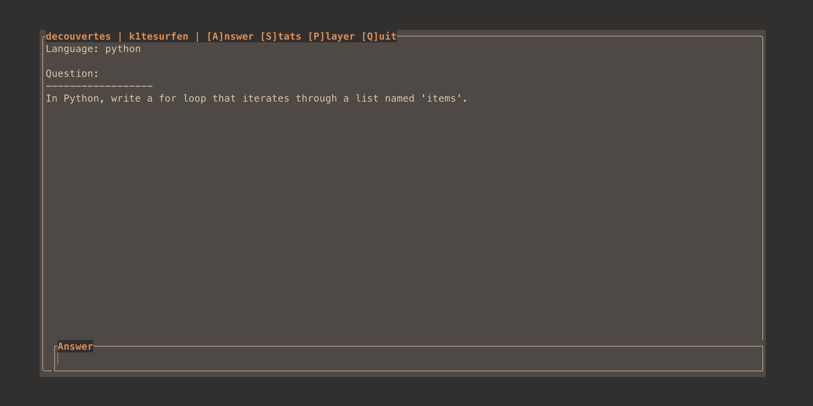

[](https://github.com/k1tesurfen/decouvertes/actions/workflows/go.yml)

# decouvertes

A terminal-based Leitner box for learning programming syntax, right in Neovim.

Currently the game is only tested on macOS



---

### Prerequisites

- **Go**: Version 1.18 or newer.
- **Neovim**: Version 0.8+ for Lua plugin support.
- **LazyVim** (or a similar Lua-based Neovim configuration).

---

### Installation

1. **Clone the Repository**

   ```bash
   git clone [https://github.com/k1resurfen/decouvertes.git](https://github.com/k1resurfen/decouvertes.git)
   cd decouvertes
   ```

2. **Build the Go CLI**

   ```bash
   # From the root of the repository
   go build ./...
   ```

3. **Install the CLI Binary**
   Move the compiled `decouvertes` binary to a directory in your system's `$PATH`.

   ```bash
   sudo mv decouvertes /usr/local/bin/
   ```

4. **Install the Neovim Plugin**
   Copy the Lua plugin file into your Neovim configuration directory.

   ```bash
   # Copy the plugin file
   cp lua/plugins/decouvertes.lua ~/.config/nvim/lua/plugins/
   ```

5. **Restart Neovim**
   LazyVim will automatically detect and load the new plugin.

---

### Configuration

The game loads questions from a `cards.json` file.

1. **Create the Config Directory**

   ```bash
   mkdir -p ~/.config/decouvertes
   ```

2. **Create your `cards.json`**
   Place a `cards.json` file inside `~/.config/decouvertes/`. The file should be an array of card objects.

   **Example `cards.json`:**

   ```json
   [
     {
       "id": "py_array_init_1",
       "language": "python",
       "tags": ["array", "list", "initialization"],
       "prompt": "Define an empty list and assign it to the variable 'foo'.",
       "solution": "foo = []"
     },
     {
       "id": "java_array_init_1",
       "language": "java",
       "tags": ["array", "initialization"],
       "prompt": "Define an empty String array with a size of 10 and assign it to 'foo'.",
       "solution": "String[] foo = new String[10];"
     }
   ]
   ```

---

### Usage

- **Start the game**: Press `<leader>dv` in Normal mode.
- **Answer a question**: Press `a` to focus the answer input. Type your answer and press `Enter`.
- **Quit the game**: Press `q` at any time.
